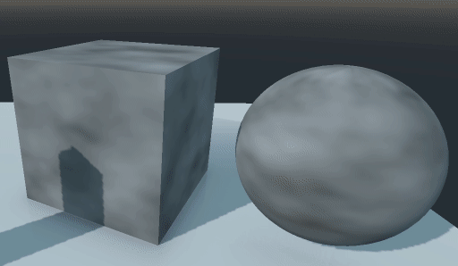

# Zelda BOTW like disolve shader for Godot Engine 3.1



There are two versions, one made with the visual shader editor tool and another using code, for the sphere and the cube respectively.

Code version:

```
shader_type spatial;
render_mode cull_disabled, depth_draw_alpha_prepass;

uniform sampler2D noise_text;
uniform vec3 color;
uniform float velocity_factor;

void fragment () {
	vec4 noise = texture(noise_text, UV);
	float input = sin(TIME * velocity_factor) / 2.0;
	
	float cut_pass = noise.r + input;	
	float border_pass = cut_pass - 0.015;
	
	cut_pass = round(cut_pass);
	cut_pass = min(cut_pass, 1);
	cut_pass = max(cut_pass, 0);
	ALPHA = cut_pass;
		
	border_pass = round (border_pass);
	border_pass = min (border_pass, 1);
	border_pass = max (border_pass, 0);
	border_pass = 1.0 - border_pass;
	
	vec3 final_border = vec3(border_pass); 
	final_border *= color;
		
	EMISSION = final_border;
}
```
